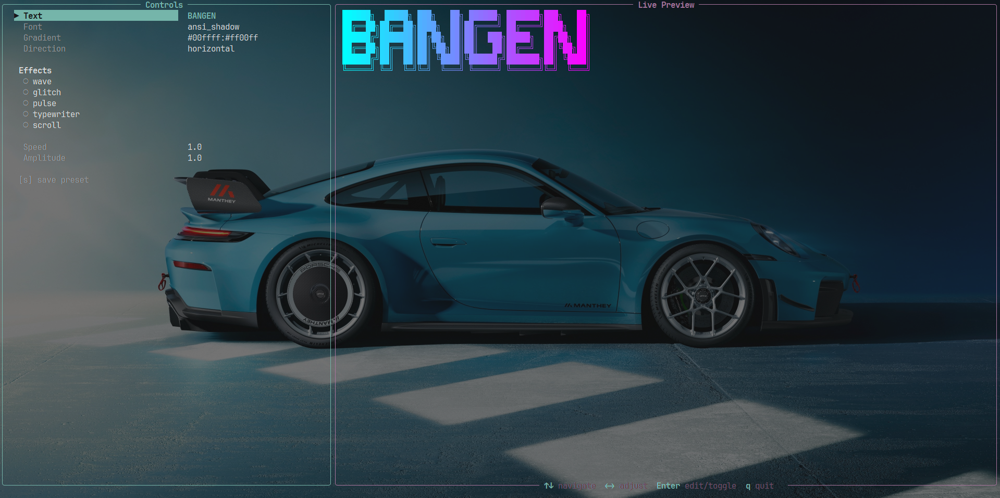

# Bangen ✨


---

**Bangen** is an ASCII banner renderer built on `pyfiglet`, `rich`, and `Pillow`.
It gives you a fast live **TUI**, a composable effect pipeline, JSON presets, and export support for `TXT`, `PNG`, and `GIF`.

Built for terminal art, title cards, intros, and animated text that still feels sharp when exported.

---

## 🌿 Screenshot



---

## Star History ⭐

<a href="https://www.star-history.com/#programmersd21/bangen&Date">
  <picture>
    <source
      media="(prefers-color-scheme: dark)"
      srcset="https://api.star-history.com/svg?repos=programmersd21/bangen&type=Date&theme=dark"
    />
    <source
      media="(prefers-color-scheme: light)"
      srcset="https://api.star-history.com/svg?repos=programmersd21/bangen&type=Date&theme=light"
    />
    
  </picture>
</a>

## Why It Stands Out ⚡

- Live split-screen TUI with export modal
- Static and animated banner rendering
- Auto-sizing based on terminal and text dimensions
- Transparent `PNG` and animated transparent `GIF` export
- Plain `TXT` export with exact ASCII output
- CLI export progress with percentage, elapsed time, ETA, and status text
- Typer-powered CLI help with cleaner option formatting and examples
- Multi-stop gradients with horizontal or vertical interpolation
- Built-in presets plus user presets stored in `~/.bangen/presets/`
- Effect library grouped into motion, visual, temporal, distortion, and signature tiers
- CLI workflows for rendering, exporting, listing assets, and loading presets

## Quick Look 👀

```bash
bangen "SYSTEM READY" --font slant --gradient "#7c3aed:#06b6d4" --effect glow --effect wave
```

## Setup 🛠️

```bash
git clone https://github.com/programmersd21/bangen.git
cd bangen
python -m venv .venv
source .venv/bin/activate
pip install -e .
```

🎯 Or download the prebuilts:

https://github.com/programmersd21/bangen/releases/latest

---

### Requirements:

- Python `3.11+`
- Pillow is included in the base install

## Quick Start 🚀

Render a basic banner:

```bash
bangen "HELLO"
```

Render with custom styling:

```bash
bangen "HELLO" --font slant --gradient "#ff00ff:#00ffff"
```

Render with effects:

```bash
bangen "HELLO" --effect wave --effect glow --effect pulse --speed 1.5 --amplitude 2.0
```

Run screensaver mode:

```bash
bangen "HELLO" --screensaver
```

Export a GIF:

```bash
bangen "HELLO" --effect wave --effect glow --export-gif banner.gif --gif-duration 3 --gif-fps 20
```

## Interface 🎛️

### TUI 🖥️

Launch the editor:

```bash
bangen
```

Controls:

- `↑↓` navigate fields and effects
- `←→` adjust font or numeric settings
- `Enter` edit or toggle the selected field
- `Ctrl+V` paste from clipboard (in text input fields)
- `a` toggle auto-size info display (shows terminal-relative sizing)
- `l` load a saved preset or load from a custom preset file
- `e` open the export dialog
- `s` save the current preset
- `q` quit

The effect selector is windowed, so you can move through the full library without overflowing the controls panel.

**Text Input:** All text input boxes (text, path, gradient) now support pasting from your clipboard using `Ctrl+V`, making it easier to work with long or complex values.

**Auto-Size Info:** Press `a` to toggle a display of the calculated banner sizing in relation to your terminal dimensions. Shows: text dimensions, calculated canvas size, scale factor, and padding.

### Export Dialog 📦

Press `e` inside the TUI to open the exporter.

- Toggle `GIF`, `PNG`, and `TXT`
- Edit the output path directly
- Adjust GIF-only `duration` and `fps`
- Auto-update the file extension when the format changes
- Show live export progress in the modal with percentage, elapsed time, ETA, and stage text
- Confirm overwrite when the target file already exists

### CLI ⌨️

The CLI is powered by `Typer`, so `bangen --help` now presents a cleaner option list and examples while keeping the same flag-based workflow.

#### Basic Rendering

```bash
bangen "HELLO"
bangen "HELLO" --font slant --gradient "#ff00ff:#00ffff"
bangen "HELLO" --gradient "#ff0000:#ffff00:#00ff00" --gradient-dir vertical
```

#### Discoverability

```bash
bangen --list-effects
bangen --list-fonts
bangen --list-presets
```

#### Presets and AI

```bash
bangen --preset cyberpunk "HELLO"
bangen --preset matrix "SYSTEM"
bangen --preset-file ./my_preset.json "HELLO"
bangen "HELLO" --ai "retro CRT hacker title"
```

#### Export

```bash
bangen "HELLO" --export-txt banner.txt
bangen "HELLO" --export-png banner.png
bangen "HELLO" --effect wave --effect glow --export-gif banner.gif --gif-duration 3 --gif-fps 20
```

CLI exports show a live progress bar with percentage, elapsed time, ETA, and the current export stage.

#### Auto-Size

Auto-sizing is **enabled by default**. It automatically adjusts banner width/height based on terminal and text dimensions for optimal rendering and exports.

Disable auto-sizing if needed:

```bash
bangen "HELLO" --no-auto-size
bangen "HELLO" --no-auto-size --export-txt banner.txt
```

Enable it explicitly (already default):

```bash
bangen "HELLO" --auto-size
bangen "HELLO" --auto-size --export-gif banner.gif --gif-duration 3 --gif-fps 20
```

**Auto-Size Features:**
- Enabled by default (use `--no-auto-size` to disable)
- Analyzes your current terminal dimensions
- Calculates optimal canvas width and height
- Applies intelligent scaling (maintains aspect ratio)
- Shows sizing info: `Text: WxH | Canvas: WxH | Scale: Sx | Padding: (X,Y)`
- Works with all export formats (`GIF`, `PNG`, `TXT`)
- Ensures exports are properly sized relative to the rendering environment

## Releases 📦

GitHub Actions builds standalone binaries for `Windows`, `macOS`, and `Linux` and uploads them to the matching GitHub release.

- asset names follow the project version from `pyproject.toml`
- release files include the platform in the filename
- the release workflow expects a tag matching the project version, for example `v2.2.3`
- release builds explicitly bundle the TUI package, effect modules, `pyfiglet` font assets, Rich, and Pillow runtime pieces so the standalone app works outside a Python environment

#### Screensaver

Turns any banner text into a full-terminal animated screensaver. It auto-fits the text to the current terminal size, switches between effect scenes, and randomizes speed, amplitude, frequency, and scene duration.

```bash
bangen "SYSTEM READY" --screensaver
bangen "NIGHT MODE" --screensaver --screensaver-duration 60
bangen "SIGNAL" --screensaver --screensaver-seed 42
```

Notes:

- `Ctrl+C` exits screensaver mode
- `--font`, `--gradient`, presets, and AI prompts still influence the starting style
- effect selection is managed by the screensaver engine, so `--effect` is not the main control surface in this mode
- export flags are ignored while screensaver mode is running

#### Terminal Animation

Useful for temporal effects such as `wipe` and `typewriter`:

```bash
bangen "HELLO" --effect wipe --animate --animate-duration 5
```

## Effects Library 🎨

### Motion

- `wave`
- `vertical_wave`
- `bounce`
- `scroll`
- `drift`
- `shake`

### Visual

- `gradient_shift`
- `pulse`
- `rainbow_cycle`
- `glow`
- `flicker`
- `scanline`

### Temporal

- `typewriter`
- `fade_in`
- `wipe`
- `stagger`
- `loop_pulse`

### Distortion

- `glitch`
- `chromatic_aberration`
- `noise_injection`
- `melt`
- `warp`
- `fragment`

### Signature

- `matrix_rain`
- `fire`
- `electric`
- `vhs_glitch`
- `neon_sign`
- `wave_interference`
- `particle_disintegration`

## Effect Stacks 🧪

Effects are order-sensitive and composable:

```python
banner.apply(build_effect("wave", config=cfg))
banner.apply(build_effect("chromatic_aberration", config=cfg))
banner.apply(build_effect("pulse", config=cfg))
```

**Multiple Effects Stability:** When combining many effects (3+), the rendering engine now intelligently normalizes opacity and brightness values to prevent pixelation, noise, and visual artifacts. This ensures your stacked effects remain sharp and clear in both TUI preview and exports (GIF, PNG, TXT).

Common style stacks:

- `cyberpunk`: `glitch` + `chromatic_aberration` + `pulse`
- `neon`: `glow` + `pulse` or `neon_sign`
- `matrix`: `matrix_rain` + `typewriter`
- `retro`: `scanline` + `flicker`
- `fire`: `fire` + `melt`
- `electric`: `electric` + `glow`

## Styling & Presets 🌈

### Gradients

Use colon-separated hex stops:

```text
#ff00ff:#00ffff
#ff0000:#ffff00:#00ff00
```

Use `--gradient-dir vertical` for top-to-bottom interpolation.

### Presets 💾

#### Storage

Saved presets live under:

```text
~/.bangen/presets/*.json
```

You can create these files manually, save them from the TUI with `s`, or save from the CLI with `--save-preset NAME`.

#### Loading

- TUI: press `l`, then choose `SAVED` or `FILE`
- CLI: `--preset NAME` loads from built-ins or `~/.bangen/presets/`
- CLI: `--preset-file PATH` loads a preset JSON from any path without saving it

#### Preset Format

```json
{
  "name": "my_preset",
  "font": "ansi_shadow",
  "gradient": "#ff00ff:#00ffff",
  "gradient_direction": "horizontal",
  "effects": ["wave", "glow", "pulse"],
  "effect_config": {
    "wave": { "speed": 1.8, "amplitude": 2.0, "frequency": 0.7 },
    "pulse": { "speed": 1.2, "min_brightness": 0.55 },
    "glow": {}
  }
}
```

Notes:

- `name`, `font`, and `gradient` should always be provided
- `effects` order matters
- `speed`, `amplitude`, and `frequency` map to shared `EffectConfig`
- any additional keys inside `effect_config` are passed to the effect constructor

## Project Layout 🧱

```text
bangen/
├── effects/
│   ├── base.py
│   ├── distortion.py
│   ├── motion.py
│   ├── signature.py
│   ├── temporal.py
│   ├── utils.py
│   └── visual.py
├── export/
│   ├── exporter.py
│   ├── gif.py
│   ├── png.py
│   └── txt.py
├── gradients/
├── presets/
├── rendering/
└── tui/
    ├── app.py
    ├── export_dialog.py
    └── preset_dialog.py
```

## Notes 📝

- Auto-sizing (`--auto-size` flag or `a` key in TUI) intelligently adjusts banner dimensions based on terminal size for optimal rendering and exports.
- Animated exports are now rendered with optimized font sizing (11px) for sharp, crisp ASCII art without pixelation artifacts.
- Animated exports look best when you keep effect stacks readable instead of maxing out distortion-heavy combinations. The rendering engine now handles complex effect stacks gracefully without artifacts.
- Temporal effects such as `wipe` and `typewriter` are best previewed with `--animate` in the terminal before exporting.
- `--screensaver` is designed for live terminal playback, not export generation.
- Text input fields in dialogs support copy-paste via `Ctrl+V` for easier workflow.

## License 📄

MIT. See [LICENSE](LICENSE).
