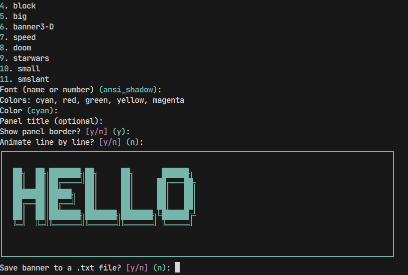

<div align="center">

```text
██████╗  █████╗ ███╗   ██╗ ██████╗ ███████╗███╗   ██╗
██╔══██╗██╔══██╗████╗  ██║██╔════╝ ██╔════╝████╗  ██║
██████╔╝███████║██╔██╗ ██║██║  ███╗█████╗  ██╔██╗ ██║
██╔══██╗██╔══██║██║╚██╗██║██║   ██║██╔══╝  ██║╚██╗██║
██████╔╝██║  ██║██║ ╚████║╚██████╔╝███████╗██║ ╚████║
╚═════╝ ╚═╝  ╚═╝╚═╝  ╚═══╝ ╚═════╝ ╚══════╝╚═╝  ╚═══╝
```

**Terminal ASCII banner generator — because plain text is boring.**

[](LICENSE)
[](https://github.com/pro-grammer-SD/bangen/stargazers)
[](https://python.org)

</div>

## ✨ Screenshot



---

## 🎨 What is Bangen?

**Bangen** is a colorful, animated terminal banner generator built on [`pyfiglet`](https://github.com/pwaller/pyfiglet) and [`rich`](https://github.com/Textualize/rich). Type a word, pick a font and a color, and watch your terminal come alive with big bold ASCII art — optionally animated, optionally saved.

No config files. No setup ceremony. Just run and render.

---

## ✨ Features

| Feature | Description |
|---|---|
| 🖋️ **Multiple Fonts** | Choose from a curated preset list or type any `pyfiglet` font name |
| 🌈 **Five Colors** | `cyan` · `red` · `green` · `yellow` · `magenta` |
| 📦 **Panel Display** | Clean bordered panel with optional title via `rich` |
| 🎞️ **Line Animation** | Optional line-by-line reveal for dramatic effect |
| 💾 **Save to File** | Export your banner to a `.txt` file instantly |
| 💬 **Interactive Prompts** | Clear, guided terminal UI — no arguments needed |

---

## 🛠️ Requirements

- 🐍 Python **3.9+**

---

## 🚀 Installation

```bash
# Clone the repo
git clone https://github.com/pro-grammer-SD/bangen.git
cd bangen

# Set up a virtual environment
python -m venv .venv
.\.venv\Scripts\activate   # Windows
# source .venv/bin/activate  # Linux / macOS

# Install dependencies
pip install -r requirements.txt
```

---

## ▶️ Usage

```bash
python bangen.py
```

Bangen will walk you through everything interactively — text, font, color, animation, and save options. No flags, no config. Just vibes.

---

## 🖼️ Example Output

```text
██████╗  █████╗ ███╗   ██╗ ██████╗ ███████╗███╗   ██╗
██╔══██╗██╔══██╗████╗  ██║██╔════╝ ██╔════╝████╗  ██║
██████╔╝███████║██╔██╗ ██║██║  ███╗█████╗  ██╔██╗ ██║
██╔══██╗██╔══██║██║╚██╗██║██║   ██║██╔══╝  ██║╚██╗██║
██████╔╝██║  ██║██║ ╚████║╚██████╔╝███████╗██║ ╚████║
╚═════╝ ╚═╝  ╚═╝╚═╝  ╚═══╝ ╚═════╝ ╚══════╝╚═╝  ╚═══╝
```

*Rendered above: `BANGEN` in `ansi_shadow` font, `cyan` color, inside a `rich` panel.*

---

## 🗂️ Project Layout

```
bangen/
├── 🐍 bangen.py          # Main application
├── 📦 requirements.txt   # Dependencies
├── 📄 LICENSE            # MIT license
└── 🙈 .gitignore         # Python defaults
```

---

## 💡 Tips

> 🔠 Want more fonts? When prompted for a font, type **any valid `pyfiglet` font name** directly.
> Explore the full list with:
> ```python
> import pyfiglet
> print(pyfiglet.FigletFont.getFonts())
> ```

---

## 📜 License

MIT — do whatever you want with it. See [`LICENSE`](LICENSE) for the legal bits.

---

<div align="center">
Made with 🖤 and too much terminal time · <a href="https://github.com/pro-grammer-SD">pro-grammer-SD</a>
</div>
